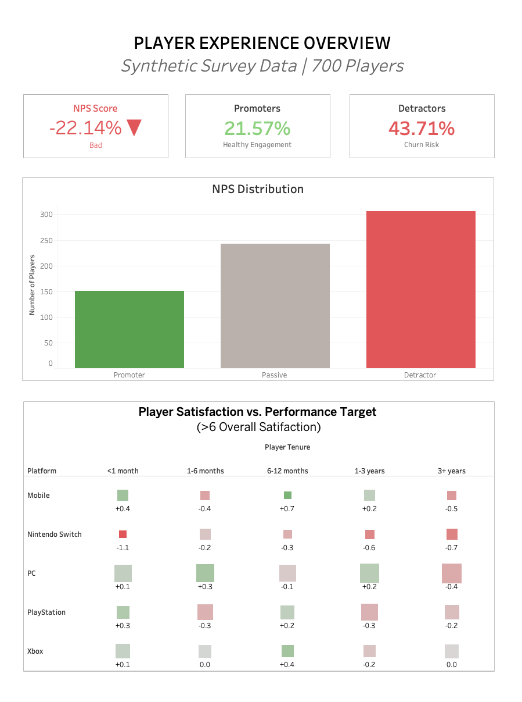

# 🎮 Battle Royale Player Sentiment & Churn Analysis

## 📌 Project Overview
This project analyzes player satisfaction, NPS, and churn risk in a battle royale game using Python and Tableau.

The objective was to identify:
- Key drivers of player satisfaction
- Relationship between engagement and NPS
- Churn risk indicators
- Monetization sentiment impact

---

## 📊 Key Insights

- NPS Score: -22.14
- 43.7% of players are Detractors
- High churn risk players show significantly lower satisfaction (4.11 vs 6.57)
- Performance satisfaction is the strongest driver of overall satisfaction
- Engagement alone does not significantly impact promoter rates

---

## 🛠 Tools Used

- Python (Pandas, Matplotlib, Seaborn)
- Jupyter Notebook
- Tableau
- Statistical hypothesis testing

---

## 📁 Project Structure

- `data/` → Raw dataset
- `notebooks/` → EDA & statistical analysis
- `tableau/` → Executive dashboard
- `images/` → Dashboard preview

---

## 📈 Executive Dashboard Preview

---

## 🚀 Business Recommendations

- Prioritize performance optimization
- Address dissatisfaction among high churn risk players
- Improve gameplay drivers over engagement frequency
